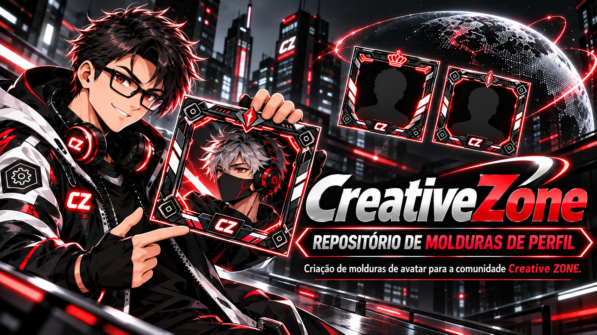

  

# Anima Pack · Molduras da Creative ZONE

**Molduras exclusivas para os avatares de quem faz a Creative ZONE acontecer.**

O Anima Pack é o repositório colaborativo de criação de molduras de avatar para o fórum **Creative ZONE**. Aqui, ideias viram artes e animações que dão personalidade aos perfis e ajudam a construir a identidade visual da nossa comunidade.

Queremos que cada membro possa se expressar também pelo seu avatar. Por isso, convidamos designers, ilustradores, desenvolvedores, animadores e pessoas curiosas a participar: proponha um tema, desenhe uma moldura, anime uma criação ou ajude a melhorar uma demonstração.

**Gostaríamos de ver toda a comunidade criando com a gente.** As molduras aprovadas serão incorporadas ao fórum para uso pelos membros da Creative ZONE. Sua contribuição pode se tornar parte do dia a dia de muitas pessoas na comunidade.

## Crie uma moldura. Deixe sua marca.

Você pode contribuir com:

- Molduras originais, estáticas ou animadas.
- Temas para eventos, conquistas e momentos especiais da comunidade.
- Melhorias de desempenho, acessibilidade e compatibilidade.
- Demonstrações em HTML, documentação, ideias e sugestões.

Não precisa chegar com tudo pronto. Abra uma issue para apresentar uma ideia ou envie um pull request com sua criação. Vamos construir esta coleção juntos, respeitando a autoria e dando crédito a quem participa.

## Como participar

1. Consulte as molduras existentes e escolha uma proposta original.
2. Crie sua arte em uma pasta própria: `animations/<nome-da-arte>/`.
3. Inclua um `index.html` funcional para que todos possam experimentar a moldura no navegador.
4. Documente a autoria, os recursos utilizados, as permissões de uso e as instruções de integração.
5. Envie um pull request com uma descrição da proposta e sua demonstração.

Use apenas artes e recursos de sua autoria ou para os quais você tenha permissão de uso e distribuição. A inclusão no fórum passa por revisão da equipe, considerando a identidade da Creative ZONE, a legibilidade dos avatares, a transparência e o desempenho das animações em computadores e celulares.

## Experimente as molduras

| ID | Animação | Demonstração |
|---|---|---|
| 001 | Moldura CreativeZone | [▶ Ver animação ao vivo](https://htmlpreview.github.io/?https://github.com/Creatiive-Lab/Anima-pack/blob/main/animations/creativezone-frame/index.html) |
| 002 | **Beta ZONE · Founder Edition** | [▶ Ver animação ao vivo](https://raw.githack.com/Creatiive-Lab/Anima-pack/133a456816e69455eeaa882c5b50a410ef198f3c/animations/beta-zone-frame/index.html) |

Clique em **Ver animação ao vivo** para abrir a demonstração renderizada diretamente no navegador. A Beta ZONE usa um endereço estável do RawGitHack ligado à branch `main`, evitando a tela em branco que o HTML Preview pode apresentar em alguns navegadores móveis. Como alternativa offline, baixe a pasta e abra `index.html`.

[Documentação da moldura CreativeZone](animations/creativezone-frame/README.md) · [Documentação da Beta ZONE](animations/beta-zone-frame/README.md).

Para novas animações: use `animations/<nome>/` e acrescente uma entrada aqui e na página inicial.

## Padrão obrigatório para cada nova arte

Toda animação deve ter sua própria pasta em `animations/<nome-da-arte>/`, contendo:

- `index.html`: demonstração funcional da arte, com animação e controles, adequada para computador e celular.
- Arquivo da animação e recursos necessários, mantidos dentro da mesma pasta.
- `README.md`: identificação da arte, instruções de uso e integração.
- `animation-manifest.json`: nome, identificador e caminho da demonstração.

A demonstração deve permitir visualizar a animação sem instalar ferramentas. Sempre que possível, manter o HTML autossuficiente para também funcionar ao ser baixado e aberto diretamente no navegador. Referências a recursos externos à página devem usar caminhos relativos.

O `index.html` da raiz é o catálogo da coleção e deve apontar para o `index.html` de cada arte. Acrescente cada nova animação ao catálogo e à tabela deste documento. Preserve as demonstrações das artes existentes.

A moldura CreativeZone é a primeira implementação desse padrão:
`animations/creativezone-frame/index.html`.

## Visualização na web

Os links **Ver animação ao vivo** usam o serviço externo HTML Preview para renderizar os arquivos públicos da branch `main`. Esse serviço não é o GitHub Pages, que permanece desativado. A disponibilidade da prévia depende do serviço e do acesso ao repositório.

Para cada nova arte, o link de demonstração no README deve usar uma URL de página publicada ou o formato `https://htmlpreview.github.io/?https://github.com/Creatiive-Lab/Anima-pack/blob/main/animations/<nome-da-arte>/index.html`. Não use um link relativo para o HTML nessa coluna, pois o GitHub abrirá o código. Os links relativos dentro das próprias páginas continuam adequados para hospedagem estática.

---

Uma iniciativa da **Creative ZONE**, criada por **Israel Miguel · Creative Lab** e aberta à participação da comunidade. Os créditos de cada contribuição devem permanecer junto à respectiva arte.
