# 001 · Animação da moldura CreativeZone

Moldura quadrada com centro e exterior transparentes. Criada para os avatares do fórum CreativeZone.

## Ver a animação

[▶ Ver animação ao vivo](https://htmlpreview.github.io/?https://github.com/Inosuke-Company/Anima-pack/blob/main/animations/creativezone-frame/index.html) — abre a demonstração no navegador pelo serviço HTML Preview.

Para usar offline: Abra `index.html` em um navegador moderno. É um arquivo independente: a arte, estilos e controles estão incorporados. Funciona sem instalação, servidor ou plano pago. Escolha uma foto local, altere fundo e tamanho, pause ou ajuste a velocidade. A foto nunca é enviada a um servidor. O estado inicial usa as iniciais CZ, não uma foto de outra pessoa.

## Usar no fórum
Copie `creativezone-animated.svg` e posicione como sobreposição ao avatar:

```html
<div class="cz-avatar">
  
  
</div>
<style>
.cz-avatar { position: relative; width: 180px; aspect-ratio: 1; }
.cz-photo { position: absolute; left: 16%; top: 14%; width: 68%; height: 66%; object-fit: cover; border-radius: 12%; }
.cz-frame { position: absolute; inset: 0; width: 100%; height: 100%; pointer-events: none; }
</style>
```

O SVG animado funciona também como imagem independente. Para controlar velocidade e pausar por JavaScript, incorpore seu conteúdo inline como na demonstração. O SVG usa CSS e respeita `prefers-reduced-motion`. Uma política CSP precisa permitir estilos inline e imagens `data:`; adaptar a política do fórum caso necessário.

## Natureza dos arquivos
O SVG fornecido continha apenas um PNG incorporado, sem vetores separados. O JSON era um roteiro que mencionava outro SVG ausente. Esta implementação é **híbrida**, não Lottie e não vetorização completa: conserva a moldura raster original, comprimida em WebP com transparência, e reconstrói os seis símbolos em SVG para animá-los. Os interiores dos ícones foram adaptados para esconder os símbolos estáticos. A palavra CreativeZone e os detalhes estruturais são preservados na imagem base. Não existe promessa de recuperação dos vetores originais.

## Camadas implementadas
- `left-code`: movimento separado dos sinais de código.
- `left-gear`: rotação contínua.
- `left-cloud`: flutuação.
- `right-community`: movimento suave do grupo.
- `right-idea`: pulsação da lâmpada e raios.
- `right-bars`: quatro barras com tempos diferentes.
- `top-crystal`: recorte do cristal flutuando e variando o brilho.
- `energy-ribbons`: luzes percorrendo as fitas.
- `hexagon-lights`: pulsos alternados nos hexágonos.
- `led-sequence`: 20 luzes em sequência.
- `micro-sparkles`: pontos de brilho independentes.
- `planet-orbit`: partículas orbitais; o planeta original permanece estático.
- `logo-shine`: faixa luminosa restrita à arte do texto.

O movimento foi ajustado para leitura em avatares pequenos; a estrutura não gira nem se desloca inteira. Os elementos que continuam incorporados na base raster não são camadas independentes.

## Arquivos
- `index.html`: demonstração completa e portátil.
- `creativezone-animated.svg`: moldura animada e autossuficiente.
- `assets/frame.webp`: arte de referência otimizada, sem animação.
- `source/original-blueprint.json`: roteiro original, preservado como referência; não é executado.
- `animation-manifest.json`: identificação e camadas realmente implementadas.

## Verificação
SVG verificado como XML; scripts verificados com Node; referências internas e transparência da imagem base verificadas. Revisão visual animada em navegador não realizada neste ambiente. Testar no navegador e no componente de avatar do fórum antes de integrar em produção.
